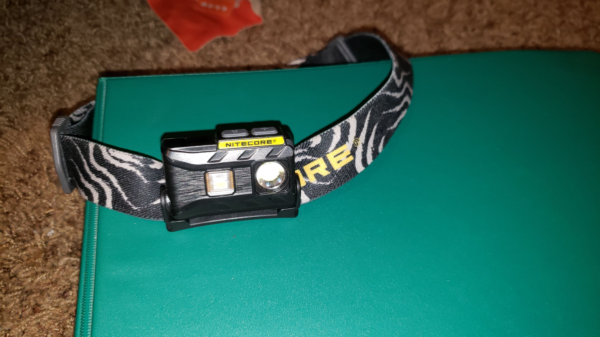
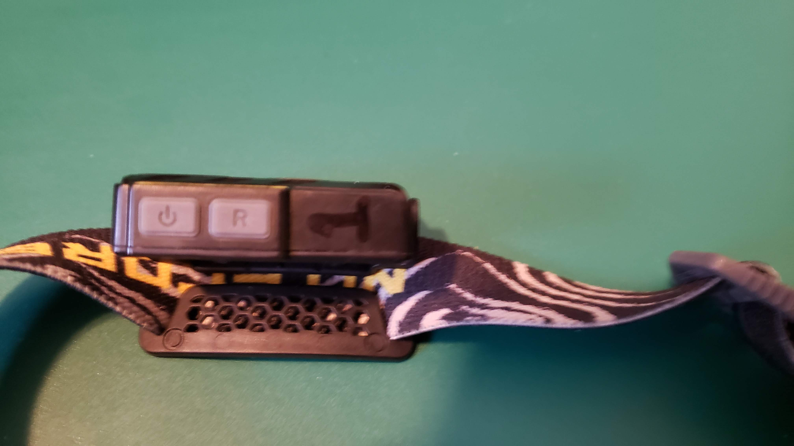

# Headlamp User Experience
#### By John Koistinen 05/17/2022

This is the Nitecore NU25 360 USB rechargeable headlamp. I use this headlamp when I am camping, or doing any activity outdoors when I need light. I actually have two of them because I had lost one only to find it immediately after purchasing a second. However, I love this headlamp so much that I don’t mind having two of them. This headlamp has lights on it, one standard white LED light and one red. 

When you are in need of a headlamp you want it to be bright, and the NU25 can get very bright. There are also times where you might not want it to be bright in order to conserve battery life such as on a night hike. The NU25 has two buttons on top of the device, one of which controls the level of the white light. Pressing it once turns the light on to the lowest setting, consecutive presses will raise the level of the light after each press. If you hold this button down it will turn the white light onto its highest setting after a few moments. This design is efficient as one button controls all of the different settings you need for the white light.

Next to the button for the white light is a similar button labeled “R”. This button controls the red light. When working at night it may be important to keep your night vision by using a red light compared to a white light. A good example of this is if you were to start watching with a telescope and needed to see to adjust some of the settings on the telescope. This design with a separate button dedicated to the red light is very effective as most headlamps only have one button to control both a red and white light, which leads users to blinding themselves by turning on the white light when they meant to turn on the red one. 

Even though there are only two buttons they perform a multitude of tasks. I have found this layout to be memorable and intuitive. I love this headlamp and would recommend it to anyone who needs one. 
